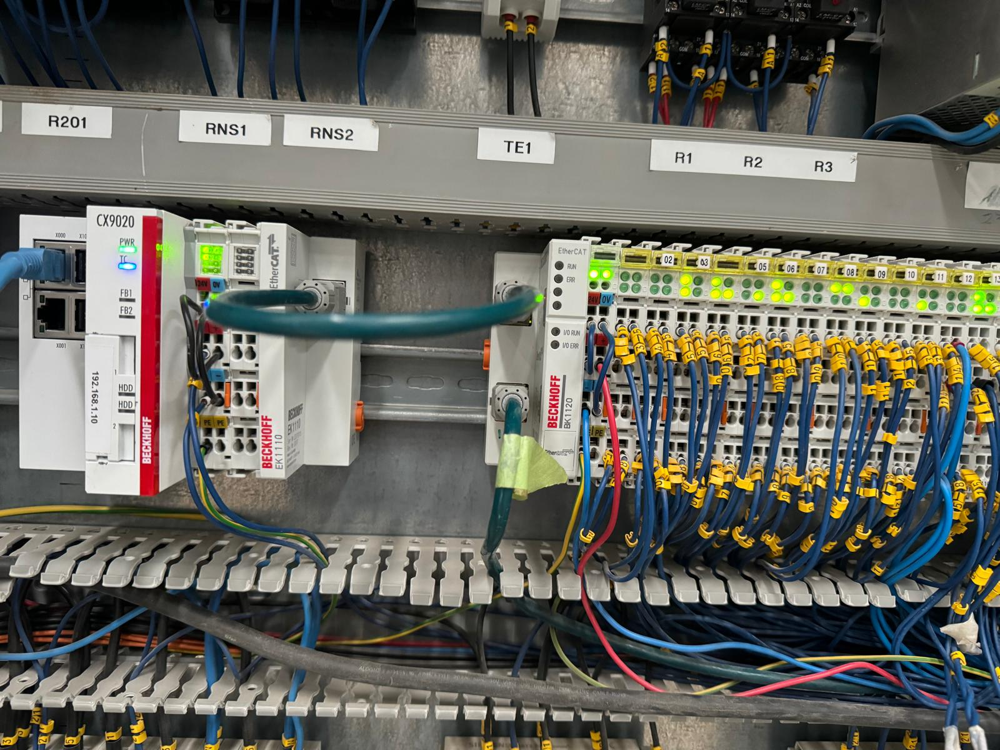
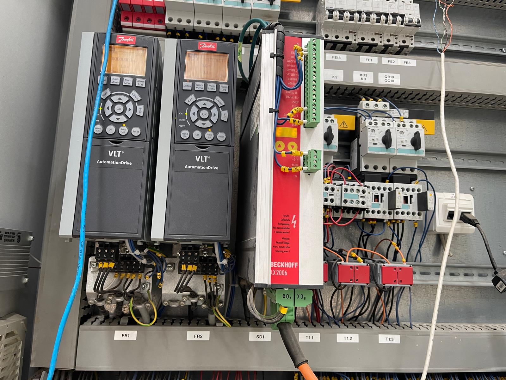
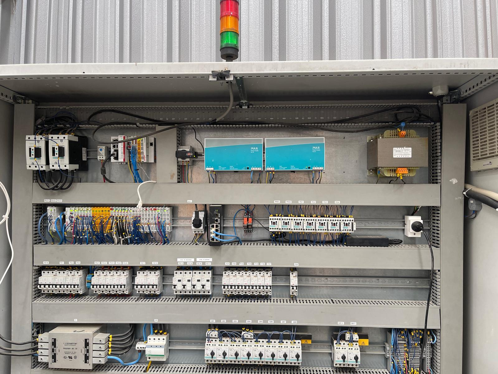
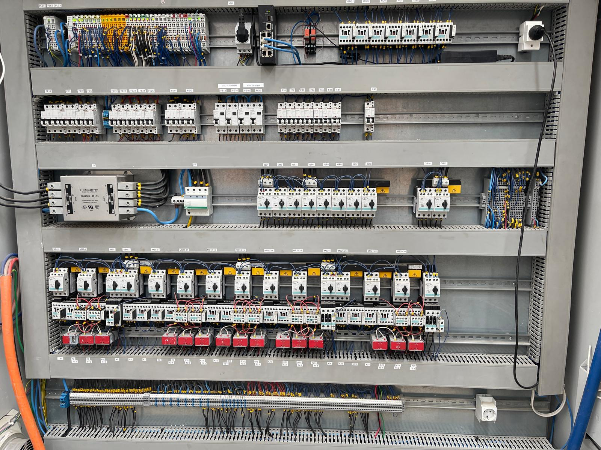

# Automation System Re-Design (Framing Machine & Tables)

Client: OZ BUILD CONSTRUCTIONS

# Introduction:

The current setup at OZ BUILD CONSTRUCTIONS' framing machine and panel tables station is fully automated and controlled by a centralized Beckhoff PLC system. This system is responsible for coordinating operations across multiple stations, including:

- Framing Station: Two nailing stations for automated framing processes.
- Panel Tables: Six tables for processing wall and floor panels.
The system consists of two main electrical cabinets, connected via EtherCAT for communication. The entire process is controlled by a central Beckhoff PLC, which receives signals from a Human-Machine Interface (HMI). Each panel has its own I/O modules, safety modules, and power supplies to ensure smooth operations.

# Project Objectives:
Decentralize Control: Separate the control systems of different stations, simplifying the management of the production line:

Upgrade to TwinCAT 3: Re-develop the existing PLC program using the latest TwinCAT 3 software to enhance system performance, scalability, and maintainability.

HMI Software Re-Development: Develop a new HMI software interface that is modern, user-friendly, and integrated with the upgraded TwinCAT 3-based PLC system.

# System Architecture:

Main PLCs: Beckhoff CX8190, CX9020

Communication Protocol: EtherCAT protocol between I/O modules, PLC, and HMI.

I/O Modules: Distributed I/O for various sensors, actuators, and safety systems.

HMI: Centralized HMI controlling and monitoring the entire system.

Technologies: Pneumatic for Nail gun station operations, Hydraulic for table lifting.

Motor Controlling: Multiple Danfoss VFD Controllers, Direct Control, and Beckhoff Servo Drive.

# Project Photos/Videos

Click the link below to see the video of full machine operations
https://vimeo.com/1019639791?share=copy#t=0

 

